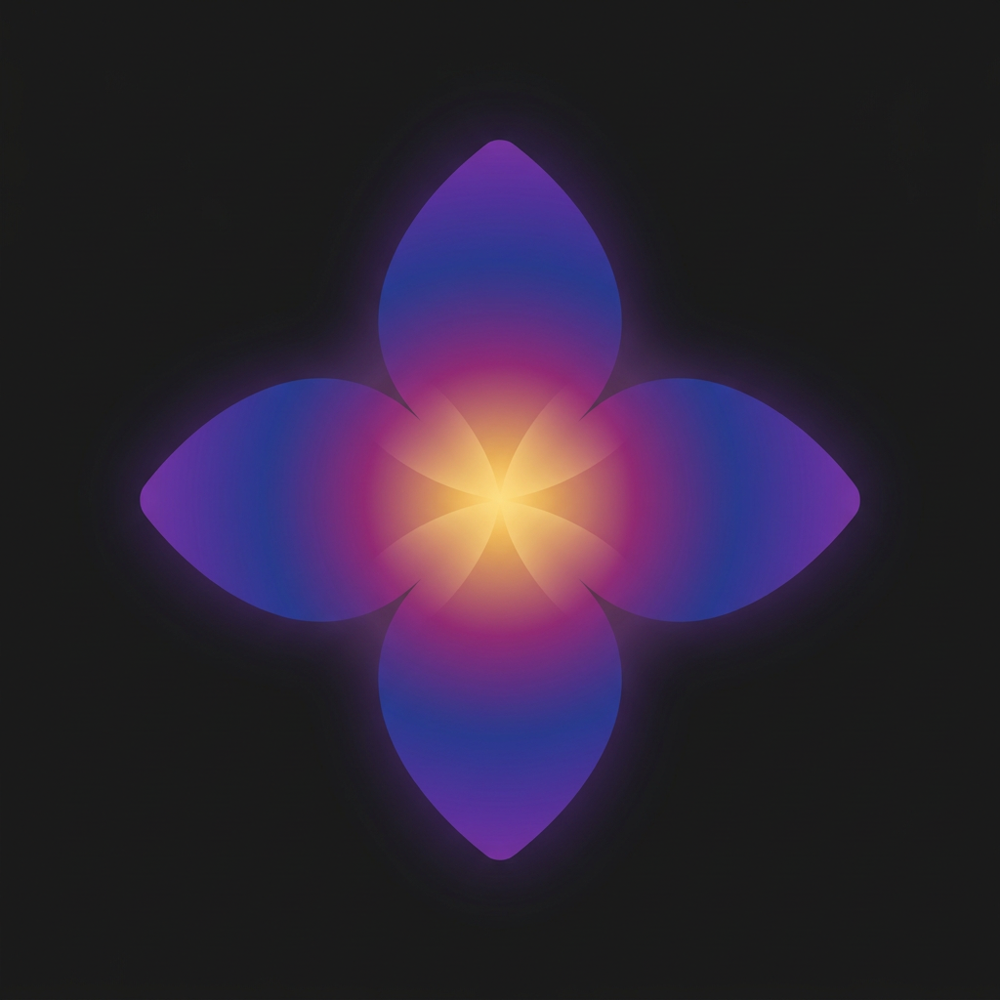

# Kekasatori

**A local-first research and prototyping cockpit for your Mac.**

[**⬇️ Download for macOS**](https://github.com/harikanthl/kekasatori/releases/latest/download/Kekasatori.dmg) · [Website](https://harikanth.site/projects/kekasatori) · [Privacy](https://harikanth.site/kekasatori/privacy) · [Terms](https://harikanth.site/kekasatori/terms)

---

Kekasatori started as a way to turn a source you want to learn from (a YouTube lecture, an arXiv / PubMed / DOI paper, a web article, or a book) into a study pack you can work through. It has grown into a cockpit for the people who actually work with research and models: find the literature, compare models, run code and benchmarks, read papers deeply, prototype in notebooks, and keep an agent with a memory at your side. It is native, local-first, and free.

This repository holds the **full source**, the release downloads, and the auto-update feed. Kekasatori is open source under the MIT license.

## Install

1. Download [**Kekasatori.dmg**](https://github.com/harikanthl/kekasatori/releases/latest/download/Kekasatori.dmg) and open it.
2. Drag **Kekasatori** into your Applications folder.
3. Launch it. The app is notarized by Apple, so it opens with no security warnings.

Kekasatori keeps itself up to date automatically, and you can check for updates any time from the app menu.

**Requirements:** macOS 15.5 or later, Apple Silicon or Intel. The Run, Notebox, and Learn features execute code in containers, which use Apple's `container` on macOS 26 Apple Silicon, or Docker / Colima as a fallback.

## What it does

### Study any source

- **Import anything.** A YouTube link, an arXiv / PubMed / DOI paper, a web article, or a book.
- **Study packs.** Clean transcripts, summaries, structured notes, flashcards, key concepts, and mind maps generated from the source.
- **A grounded AI tutor.** Chat about the material and get answers drawn from your document through retrieval, not guesswork.
- **A workshop to think in.** A built-in Excalidraw canvas, a notebook kept with each source, and animated Manim explainers for math and formulas.

### The research cockpit

- **Discover.** Multi-source literature search across Semantic Scholar, arXiv, OpenAlex, Europe PMC, and bioRxiv / medRxiv, with a field switcher, a trending feed, and an in-app paper page (AI TL;DR, BibTeX, offline task / method tags).
- **Compare.** A bring-your-own-key model arena: one prompt across many models side by side, with a live cost meter. Cloud models, local servers (Ollama, LM Studio, llama.cpp), and the Hugging Face router all slot in.
- **Run.** Write and run Python or shell in a container, and point lm-eval or inspect-ai at any endpoint to run benchmarks, locally or on serverless GPUs (Hugging Face, RunPod, Modal). The same image runs locally now and on a GPU later.
- **Deep Research.** Reads full open-access papers and answers with quoted, cited excerpts, with an optional skeptical critique pass that argues with its own conclusions.
- **Notebox.** Reactive [marimo](https://marimo.io) notebooks with a SQL stack (DuckDB) wired in.
- **Cockpit.** A Workspace ties a source, an environment, a compute target, and its run history together, with a compute dial that promotes the same job from your laptop to a rented GPU in one selection.
- **Agentic memory.** A local-first memory and temporal knowledge graph: an agent that recalls your context, improves as you use it, and asks before it switches compute or launches a run.
- **Learn.** Implement-it-yourself tracks (ML from scratch, data cleaning, and reinforcement learning), each checked by running your code in a container.
- **Agents (MCP).** A bundled MCP server so your own AI assistant can search your library.

## Private by default

This is the part we care about most. If your Mac supports Apple Intelligence, the whole experience, including the tutor, runs **on-device**. No account, no sign-up, no server, and nothing about what you study leaves your machine. If you want a larger model, you can bring your own key for Claude, GPT, Gemini, or DeepSeek, and even then your queries go only to the provider you chose. The same is true of compute: keys for Hugging Face, RunPod, or Modal are used only to reach those services. All keys are stored in the macOS Keychain.

See the [Privacy Policy](https://harikanth.site/kekasatori/privacy) and [Terms](https://harikanth.site/kekasatori/terms).

## Building from source

Requirements: Xcode 16 or later, macOS 15.5+.

1. Clone the repo and open `MuseDrop.xcodeproj`. (The Xcode target keeps the internal codename **MuseDrop**; the product is Kekasatori.)
2. The bundled `yt-dlp` and universal `ffmpeg` binaries are **not committed** (see `.gitignore`). Drop them into `MuseDrop/Resources/bin/`. The app also fetches and updates `yt-dlp` at runtime.
3. Build and run the `MuseDrop` scheme.
4. Optional: math animations require a local [Manim](https://www.manim.community/) + LaTeX install.

To produce a signed, notarized release, see [`scripts/package-and-notarize.sh`](scripts/package-and-notarize.sh) and [`scripts/sparkle-release.md`](scripts/sparkle-release.md).

## License

The Kekasatori source is released under the [MIT License](LICENSE).

The **distributed app** also bundles third-party components under their own licenses, including **FFmpeg (GPL)** and **yt-dlp (The Unlicense)**. FFmpeg runs as a separate executable (a subprocess), so it does not affect the MIT licensing of this source; see [`THIRD_PARTY_LICENSES.md`](THIRD_PARTY_LICENSES.md).

## Notes

- You are responsible for ensuring your use of any third-party source complies with that service's terms and with applicable copyright law.

---

Built by <a href="https://harikanth.site">Harikanth Lingutla</a>.

